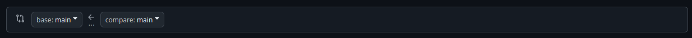
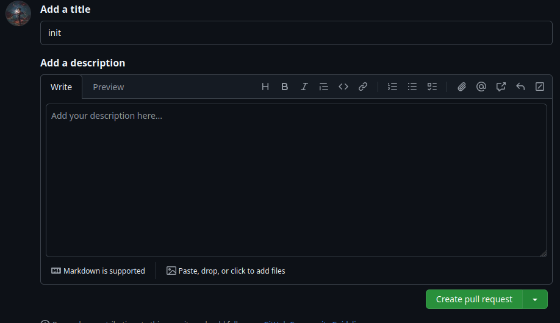
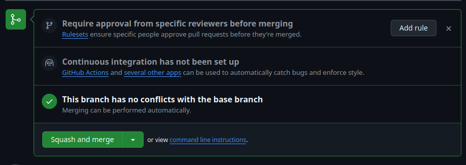

# ORC S3 project

## PROJECT RULES

### ARCHI

- \*.c = \*.h
- 80 caractères **__max__** par ligne
- eviter les fichier c de +200 lignes
- mettre .out sur les exécutable
- put .png file un /photo directory

### GITHUB REGLES

- 1 feature = 1 branches
- merge via le site
- suprimer la branche une fois merge
- lors du premier push sur une branche faire une pull request

### TUTO GIT

* Créer sa branche :
    * `git branch <nom>`
    * `git checkout <nom>`
    * `git push --set-upstream origin <nom>`
* Lors du premier push :
    * créer une pull request comme ça on garde un suivie de la branche sur git
      et ont peut faire des commentaires si besoin
    * se fait directement sur le site
    
        1. 
            
        
        2. metre dans base: le main et dans compare la branche créé
            
        
        3. 
            
        
        4. 
            
* Dev :
    * `git status` (on ne sait jamais)
    * `git add <nom de fichier>` ou `git add .` pour tout d'un coup
    * `git commit -m "mon message"`
        * mettre se que l'ont a fait dans le message du commit
    * `git push`
* Fin du Dev
    * Squash and merge la branche et la delete comme montré avec les photos si
      dessous
        
        1.
            

        2.
            

        3. `git checkout main`
        4. `git branch -d <nom>
* Faire d'autre choses
